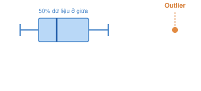

# Các chỉ số

## RFM: Recency, Frequency, Monetary

*Mục tiêu*: Phân khúc khách hàng dựa trên hành vi mua sắm.

- Recency: lần mua gần nhất. Công thức: Recency = Ngày phân tích - Ngày mua hàng gần nhất.
  
- Frequency: tần suất mua hàng. Công thức: Frequency = Số đơn hàng hợp lệ trong kỳ phân tích.
- Monetary: tổng giá trị mua hàng. Công thức: Monetary = Tổng giá trị mua hàng trong kỳ phân tích.

Ví dụ:

## IQR: Interquartile Range

IQR (Interquartile Range) là khoảng tứ phân vị, một phương pháp thống kê dùng để xác định các giá trị nằm quá xa phần lớn dữ liệu.

$IQR = Q_3 - Q_1$

Outliers là các giá trị nằm ngoài khoảng:  $[Q_1 - 1.5IQR, Q_3 + 1.5IQR]$

## ABC: Phân loại sản phẩm theo doanh thu

### Quy trình tính ABC
1. Tính tổng doanh thu của từng sản phẩm.
2. Sắp xếp sản phẩm theo doanh thu từ cao xuống thấp.
3. Tính tỷ lệ đóng góp và tỷ lệ doanh thu tích lũy.
4. Phân loại thành ba nhóm A,B,C theo ngưỡng đã chọn.

### Revenue

Revenue = Quantity * UnitPrice