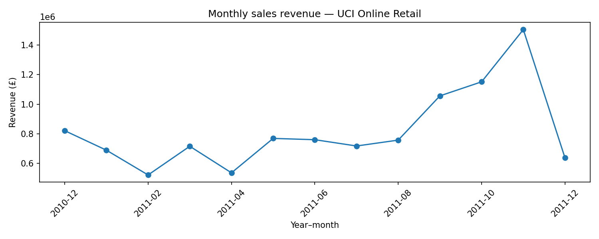
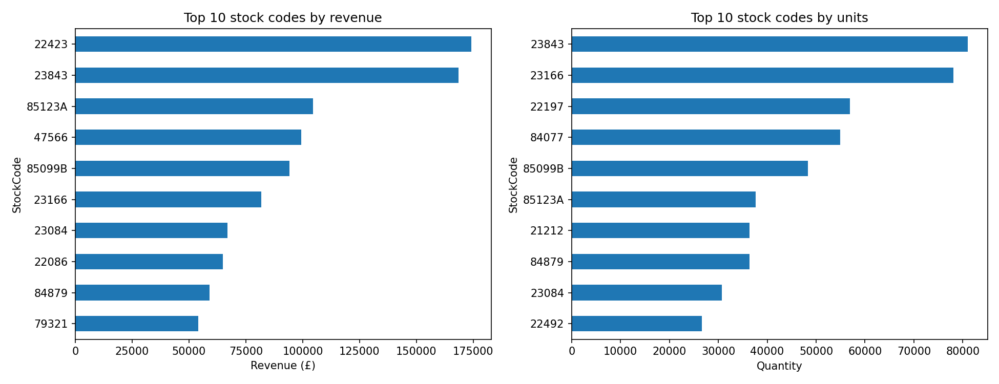
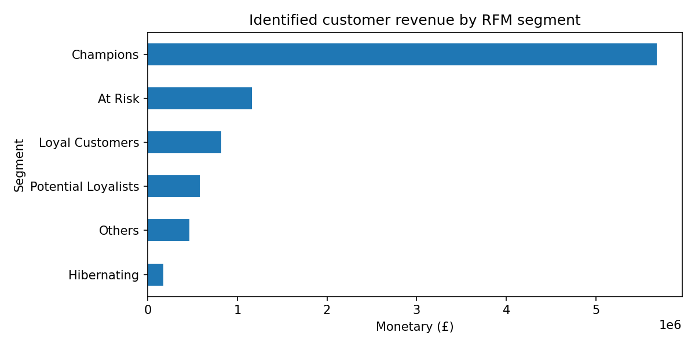
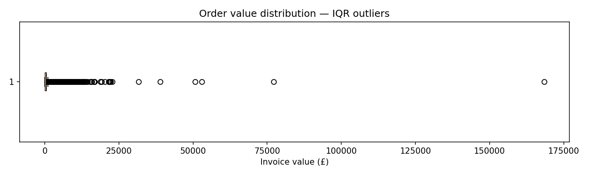

# Final Analytics Report & Business Insights

**PDS301m — E-Commerce Analytics Pipeline | Issue #19**  
**Report integration:** Mẫn | **Review:** Huy  
**Data:** UCI Online Retail (2010-12-01 to 2011-12-09)  
**Evidence baseline:** `reports/kpi_reconciliation.md` (#18), `notebooks/06_final_integrated_analysis.ipynb` (#22), `reports/revenue_product_eda.md` (#7), and saved charts under `charts/`.

> **Reproducibility note:** This report uses the reconciled #18/#22 baseline and supplied processed CSVs. The order-level impact assessment reuses `src/anomaly_detector.py` from the integrated repository, not a competing implementation. The supplied cancellation export was independently audited. Revenue-impact figures are a supplementary, reproducible breakdown of existing IQR flags and do not replace any KPI in #18/#22.

## 1. Project Overview and Research Questions

This project investigates revenue and product concentration, customer value using Recency–Frequency–Monetary (RFM) segmentation, and unusually large orders in UCI Online Retail transaction data. It addresses the P4 question: **Which customers and products contribute most to revenue, and do any orders exhibit statistical anomalies?** Secondary questions cover monthly revenue dynamics and geographic market concentration.

UCI Online Retail is the sole source for transaction/revenue calculations. The Books to Scrape exercise is separate collection evidence and is not joined to retail transaction data.

## 2. Dataset and Data Cleaning

The reconciled analysis population comprises **524,878 valid sales line items** between **1 December 2010 and 9 December 2011**. Cleaning removes invoices beginning with `C` (cancellations), rows with non-positive `Quantity` or `UnitPrice`, and exact duplicates. Valid-line revenue is `Revenue = Quantity × UnitPrice`. The reconciliation reports **0 remaining exact duplicates**, **0 remaining non-positive quantity/price rows**, **5,268 duplicates removed** (value £21,740.98), and **2,512 invalid lines removed**. The baseline cleaning counts are reported by #18; anomaly and cancellation populations were independently audited against the supplied files for #19.

Rows without an identifiable customer are represented as **Guest**. They remain in total sales revenue but are **excluded from customer-level RFM**. This population distinction is essential:

| Revenue measure | Population | Amount |
|---|---|---:|
| Total sales revenue | All valid sales lines, including Guest | **£10,642,110.80** |
| Identified-customer revenue / RFM Monetary | Valid sales assigned to non-Guest CustomerID | **£8,887,208.89** |
| Guest revenue | Valid sales assigned to Guest | **£1,754,901.91** |

These populations reconcile exactly: identified-customer revenue + Guest revenue = total sales revenue. Guest revenue represents approximately **16.5%** of valid sales; it must not be attributed to customer segments. Service/fee product codes remain in total revenue, but qualifying service codes are excluded from ranked merchandise product lists.

**Evidence:** `reports/kpi_reconciliation.md` sections 2–3; Final Notebook sections 2 and 8; cleaning logic in `src/data_processor.py`.

## 3. Revenue and Product Analysis

### 3.1 Monthly revenue and geographic market mix

The monthly revenue series peaks in **November 2011 (approximately £1.5 million)**. The EDA report describes lower months in **February and April 2011 (approximately £0.52 million each)** and growth from September through November 2011. This is consistent with a late-year seasonal increase, but is not causal evidence about promotions or holidays. **December 2010 and December 2011 are incomplete boundary months** and should not be compared as full months.

**United Kingdom** contributes approximately **£9.00 million**, or **84.6%** of total revenue, making this a highly concentrated UK-centric revenue base. Netherlands, EIRE, Germany and other markets contribute a much smaller share. This concentration makes UK performance particularly material to total sales.

**Evidence:** `charts/final_monthly_revenue.png`; Final Notebook section 4; `reports/revenue_product_eda.md` section 3.2–3.3; source `src/eda.py`.

### 3.2 Product leaders: revenue versus volume

The leading merchandise stock codes by **revenue** are **22423 (£174,157)**, **23843 (£168,470)** and **85123A (£104,463)** (rounded values reported by #7). The leading stock codes by **quantity** are **23843, 23166 and 22197**. Code **23843** appears in both top-three lists. Thus volume ranking and revenue ranking answer different questions and should not be treated as interchangeable.

Service/fee codes such as `DOT`, `POST`, `M` and `AMAZONFEE` were excluded from the merchandise rankings while remaining in sales-revenue totals. This rule is important to avoid describing postage or manual adjustment charges as top-selling retail products.

**Evidence:** `charts/final_top_products.png`; Final Notebook section 5; `reports/revenue_product_eda.md` section 3.4; source `src/eda.py`. No standalone ABC result was evidenced in the inspected final outputs, so ABC is not presented as a required P4 finding.

## 4. Customer RFM Segmentation

RFM is calculated only for identified customers on eligible valid sales. **Recency** is the number of days since a customer's last purchase, measured relative to the day after the latest eligible purchase date. **Frequency** counts distinct qualifying invoices rather than item lines. **Monetary** sums a customer's valid sales revenue. The project uses percentile-based R/F/M scoring and mutually exclusive, rule-based segment assignment as implemented in `src/feature_engineering.py` (not K-Means results).

| Segment | Customers | Revenue (£) | Share of identified revenue |
|---|---:|---:|---:|
| Champions | 911 | 5,676,143.38 | 63.9% |
| At Risk | 938 | 1,161,835.10 | 13.1% |
| Loyal Customers | 381 | 823,495.76 | 9.3% |
| Potential Loyalists | 484 | 583,120.23 | 6.6% |
| Others | 835 | 465,436.79 | 5.2% |
| Hibernating | 789 | 177,177.63 | 2.0% |
| **Total** | **4,338** | **8,887,208.89** | **100%** |

Percentages are rounded individually. Champions account for approximately **63.9% of identified-customer revenue** while representing **911 of 4,338 identified customers** (about 21%). At Risk is the **largest segment by customer count (938)** and ranks second by revenue (approximately 13.1%). These are distinct observations: the largest customer population is not necessarily the most valuable revenue population.

**Evidence:** Final Notebook section 6, including executed `segment_view` output; `reports/kpi_reconciliation.md` section 4; `charts/final_rfm_segment_revenue.png`; `docs/rfm_methodology.md`; `src/feature_engineering.py`.

## 5. Order Anomaly Analysis

Order anomalies are assessed **at distinct invoice/order level**, not at sales-line level. The detector in `src/anomaly_detector.py` aggregates invoice revenue and quantity, then flags upper-tail observations separately for each dimension using the **1.5× interquartile range (IQR)** criterion:

`Upper threshold = Q3 + 1.5 × (Q3 − Q1)`.

| Anomaly metric | Reconciled notebook output |
|---|---:|
| Distinct analyzed invoices | 19,960 |
| Upper threshold for invoice revenue | £1,006.11 |
| Upper threshold for invoice quantity | 636.5 units |
| Invoices flagged on revenue | 1,811 |
| Invoices flagged on quantity | 1,445 |
| Invoices flagged on either criterion | **2,185 (about 10.9%)** |

These categories overlap. The combined number is the **union**, not the sum of the separate counts. The largest recorded invoice in the Final Notebook's top-five flagged table is **581483 (£168,469.60)**. This is a statistical high-value order observation, not an independently established error or fraudulent transaction.

**Impact on revenue/KPIs:** The supplementary `anomaly_orders.csv` contains **1,811 distinct revenue-flagged invoices**, rather than the complete revenue-or-quantity union. To avoid inferring combined impact from that partial export, the existing `src/anomaly_detector.py` was run against the full supplied `data/processed/cleaned_retail.csv`, with **the same IQR criteria as Final Notebook #22**. The resulting invoice-level flags precisely reproduce **19,960 invoices, 1,811 revenue flags, 1,445 quantity flags and 2,185 combined flags**, as well as the **£1,006.11** revenue and **636.5 units** quantity thresholds. The 2,185 flagged invoices contribute **£5,345,163.73 (50.23%)** of valid sales revenue **£10,642,110.80**, despite representing only **10.95%** of orders. Revenue-only flagged invoices contribute **£5,089,007.77**; the **374 quantity-only** flagged invoices contribute another **£256,155.96**. The remaining 17,775 invoices contribute **£5,296,947.07 (49.77%)**. These are **descriptive concentration figures**, not invalid-sales adjustments; excluding flagged orders is not recommended without further business validation.

**Reproducible evidence:** `data/processed/anomaly_orders_union_issue19.csv` (2,185 flagged invoices, including `Revenue`, `TotalQuantity`, `LineCount`, `IsRevenueAnomaly`, `IsQuantityAnomaly` and `IsAnomaly`) is a supplemental report evidence export produced by the project's detector. Original `anomaly_orders.csv` is a revenue-only subset and is not treated as the combined export.

**Evidence:** Final Notebook section 7 (saved threshold, counts and top-five invoices); `charts/final_order_value_boxplot.png`; `src/anomaly_detector.py`; `reports/revenue_product_eda.md` section 3.5.

## 6. Integrated Findings and Evidence-Based Recommendations

**Finding 1 — concentration by customer:** Champions deliver nearly two-thirds of identified-customer revenue despite accounting for about one-fifth of customers. **Recommendation:** prioritize retention-service analysis for Champions, using this observed revenue concentration to justify further evaluation; actual retention uplift or campaign ROI cannot be inferred from this dataset.

**Finding 2 — potential retention focus:** At Risk contains the largest number of customers and the second-largest identified revenue pool (£1.16 million). **Recommendation:** evaluate targeted re-engagement for this cohort, then measure its incremental effect separately before claiming business impact.

**Finding 3 — concentration by market and product:** UK sales dominate total revenue (84.6%), and the highest-selling-by-volume stock codes differ from the leaders by revenue. **Recommendation:** monitor UK concentration risk and assess product assortment using both gross revenue and volume, with merchandise-only rankings.

**Finding 4 — revenue concentration among unusual orders:** 2,185 of 19,960 invoices (10.95%) meet at least one upper-tail IQR rule and account for £5,345,163.73 (50.23%) of valid sales revenue. **Recommendation:** prioritize contextual review of high-value/bulk orders and conduct sensitivity reporting, while retaining them in baseline KPIs unless business evidence justifies exclusions.

These recommendations are **hypotheses/priorities supported by descriptive evidence**, not proven causal interventions. The anomaly revenue concentration is computed using the already-implemented #22 detector on the supplied reconciled population; it is not evidence of fraud.

## 7. Limitations and Conclusion

**Scope and temporality.** These data cover one UK-based merchant over roughly one year, with incomplete December boundary months. They do not establish patterns generalizable to the wider retail industry.

**Customer identification.** Guest transactions contribute £1.75 million to all-customer sales but cannot be allocated to RFM customer segments. Total sales revenue and the sum of RFM Monetary are consequently different by design.

**Cleaning and accounting assumptions.** Cancelled invoices, invalid quantity/price rows, and duplicates are removed from the valid-sales analytical baseline. This is not equivalent to a net-cash-flow or refunds-inclusive accounting statement. The subsequently provided `cancelled_retail.csv` independently contains **9,251 cancellation line items across 3,836 distinct `InvoiceNo` values**; every distinct invoice number begins with `C`. **9,251 is a row count, not a distinct-invoice count.** This confirms the cancellation-file population, but does not by itself verify the complete raw-to-cleaned pipeline.

**Statistical versus operational anomaly.** IQR flags numerical extremity in revenue or quantity; they do **not** establish fraud, data-entry error or illegitimate orders. Outlier flags are particularly sensitive to bulk purchases and heavy-tailed retail order distributions.

**Evidence completeness.** The latest Issue #22 repository ZIP contains `cleaned_retail.csv`, `customer_segments.csv`, and `revenue_by_segment.csv`, as well as executed notebook outputs and four final charts. The separately supplied cancellation and revenue-only anomaly exports were audited; `cancelled_retail.csv` is included in this delivery under `data/processed/`. The combined anomaly export was constructed with the existing `OrderAnomalyDetector` and can be regenerated from `cleaned_retail.csv`. The Issue #18 note calling 9,251 items “hóa đơn” should be read as 9,251 **lines**, not distinct invoices; the distinct cancellation invoice count is 3,836. These supplemental clarifications do not alter the reconciled total revenue.

**Conclusion.** The P4 analysis identifies substantial customer revenue concentration in **Champions**, geographically concentrated UK sales, different leaders by product revenue and sales volume, and **2,185 statistically unusual invoices**. The reconciled baseline is **£10,642,110.80** across **524,878 valid sales lines**, with **£8,887,208.89** attributable to identified customers. The findings are suitable for descriptive prioritization and follow-up investigation, not causal or fraud conclusions.

---

### Traceability and delivery notes

| Claim / visual | Primary evidence | Upstream analysis implementation |
|---|---|---|
| Cleaning populations and baseline revenue | `reports/kpi_reconciliation.md` §2–3; Final Notebook §2, §8 | `src/data_processor.py`, `src/reconcile.py` |
| Monthly/country revenue | Final Notebook §4; `charts/final_monthly_revenue.png` | `src/eda.py` |
| Revenue/quantity product ranks | Final Notebook §5; `charts/final_top_products.png`; EDA report §3.4 | `src/eda.py` |
| RFM definition, segment count/revenue | Final Notebook §6; `charts/final_rfm_segment_revenue.png`; KPI reconciliation §4 | `src/feature_engineering.py`, `src/reconcile.py` |
| IQR methodology, combined flagged-invoice revenue impact | Final Notebook §7; `charts/final_order_value_boxplot.png`; `data/processed/anomaly_orders_union_issue19.csv` | `src/anomaly_detector.py` |
| Cancellation rows versus distinct invoices | `data/processed/cancelled_retail.csv` and Issue #18 cancellation audit | `src/anomaly_detector.py` (`analyze_cancelled_orders`) |

**Review status/QA:** All required inputs for report-level evidence are now present; the combined flagged-order revenue impact was reproduced with the project’s detector without changing reconciled #18/#22 KPIs. Before closing #19, Huy must review the report, explicitly acknowledge the #18 wording correction (9,251 cancellation lines versus 3,836 distinct invoices), and approve the PR. No PR merge or Huy approval is claimed here.
